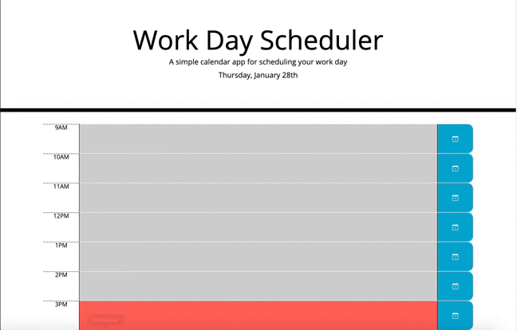

# Calander-Scheduler
With this assignment we were tasked with doing the logic for this scheduling calander which dynamically changes the background colors for the event blocks based off if they are in that hour in the past or in the future. The calander also allows the events to be saved since they are attached to local storage.

I make the backgrounds change by attaching the change of class to the time. The biggest issue I ran into was ensuring that the blocks would ensure they had the right class by reseting the classes after the work day and before work day.

https://fitzpatb.github.io/Calander-Scheduler/